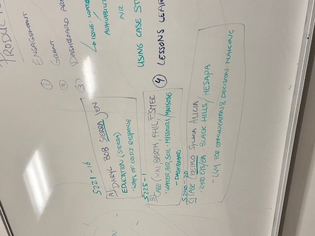
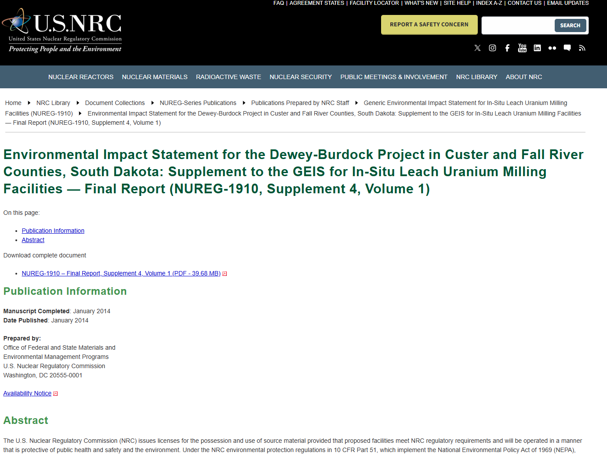
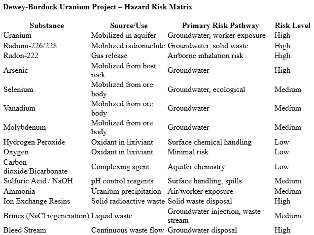
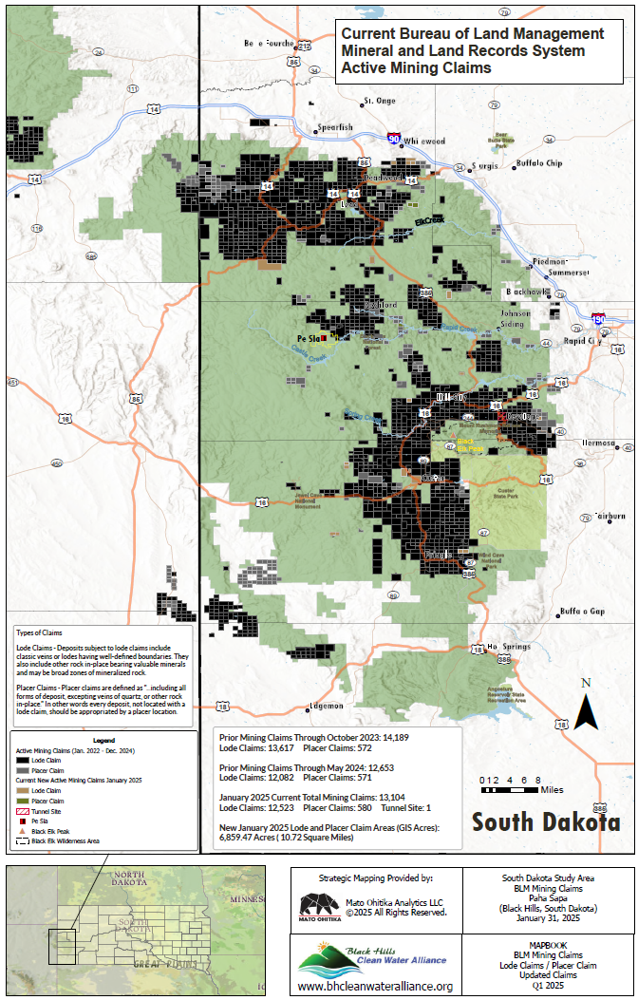

# He Sapa Makiyuta EA/EIS Study

<a href="https://github.com/CU-ESIIL/wildcard-topic-innovation-summit-2025__20/edit/main/docs/index.md" title="Edit this page">✏️</a>

<!-- =========================================================
HERO (Swap hero.jpg, title, strapline, and the three links)
========================================================= -->

**One sentence on impact:** Tribal groups want to collaborate to create pragmatic tools to better understand information to protect their land, resources, and sovereignty.

**[Draft project brief (PDF/A)](assets/Seven%20ways%20to%20measure%20fire%20polygon%20velocity-4.pdfa) · [View shared code](https://github.com/CU-ESIIL/wildcard-topic-innovation-summit-2025__20/blob/main/code/prism_quicklook.py) · [Explore data](https://github.com/CU-ESIIL/wildcard-topic-innovation-summit-2025__20/blob/main/code/prism_quicklook.py)**

> **About this site:** This is a public, in-progress record of Innovation Summit Team 20. Update anything here in your browser: open a file → pencil icon → Commit changes. The page is structured so we can talk through the project in under two minutes.

---

## Day 1 — Define & Explore
### Our product 📣
- A dashboard/interactive search tool to more easily comb through 2,400 Environmental Impact Statement/Assessment documents from the US Forest Service, US NRC, BLM, etc.

### Our question(s) 📣
- How can we create a tool for non-technical tribal decision-makers to access and understand meaningful information about extractive activities in the HeSapa through EIAs?

### Hypotheses / intentions

### Why this matters (the “upshot”) 📣
- HeSapa is sacred land to tribes and exposed to extractives activities 
- The information will be accessible to non-technical audiences
- Supports corporate accountability & transparency; environmental justice; and treaty rights around extractive activities in the HeSapa

### Inspirations (papers, datasets, tools)

### Field notes / visuals

---

## Day 2 — Data & Methods
*Focus: tribal engagement to identify key indicators of concern, human-review of a typical EIS, metadata capture, intial steps of PDF extraction.*

### Data sources we’re exploring 📣
- Public documents (PDFs) such as Environmental Impact Statements and Assessments from agencies such as Forest Service, EPA, US NRC, BLM.

  
[Raw photo location: explore_data_plot.png](https://github.com/CU-ESIIL/wildcard-topic-innovation-summit-2025__20/blob/main/docs/assets/explore_data_plot.png)
  *Snapshot: EIS for the Dewey-Burdock Project for In-Site Leach Uranium Milling Facilities.*

### Methods / technologies we’re testing 📣
1. **Engagement**: Engaged with the tribal members to identify key indicators of concern and desired product output.
2. **Centralize and Structure the Data**:
   - PDF Extraction: Use Python/R to extract relevant test from PDFs.
   - Metadata capture: For each EIS/EA document determine the most relevant information to capture:
      - Document title
      - Agency names
      - Company name(s)
      - Geographical project location/coordinates
      - Type of extractive activity (e.g., mining, forestry)
      - Byproducts from extractive activities (e.g., contaminants or residues)
      - Key environmental impact categories 
    - Spreadsheet/Database: Store this data in a structured format (CSV) so it can be filtered and searched.
3. **Automate Key Information Extraction**:
   - Create training set for any LLM models.
   - Keyword Tagging: Use models to flag mentions of relevant fields.
4. **Build a Long-Term Knowledge Sharing Base**
   - Build a dashboard that can tribal leaders can use for more evidence-based decision-making.
   - Overlay project sites (pending necessary geograhpical coordinate data) to visualize where activities intersect with culturally and ecologically sensitive areas.

### Challenges identified
- Missing information: Certain projects were waived from creating EIS/EA for categorical exclusion.
- If any PDFs are not machine-readable, integrate OCR.
- Writing a generalized code that can effectively parse through PDFs of various formats to capture necessary data.
- Does the language used in the metadata schema reflect tribal community values?

---

## Final Share Out — Insights & Sharing

### Visuals that tell the story 📣

*Visual 1.* Potential chemicals and their risk from Dewey Burdock Project.

*Visual 2.* Black Hills Map and Active Mining Claims.

### Findings at a glance 📣
- **Key priority areas for tribes:** Impact of extractive activites on historical resources, cultural sites, wildlife (bison), water bodies, soil, air, plant life, and broader ecosystems
- **Test and refine workflow with a handful of human-reviewed EIS/EAs:** human review of PDFs compares to machine-generated PDF parse results for accuracy and quality.
- **Deeper Knowledge of the Land:** Work with tribal partners to understand the language of the land.

### What’s next? 📣
- Refine the PDF search tools, LLM, etc.
- Broader group: ESIIL Working Group & CU Boulder Research & Innovation Seed Grant Program

---

## Featured links (image buttons)
<table>
<tr>
<td align="center" width="33%">
  <a href="assets/Seven%20ways%20to%20measure%20fire%20polygon%20velocity-4.pdfa"> <strong>Read the brief</strong></a>
</td>
<td align="center" width="33%">
  <a href="https://github.com/CU-ESIIL/wildcard-topic-innovation-summit-2025__20/blob/main/code/prism_quicklook.py"> <strong>View code</strong></a>
</td>
<td align="center" width="33%">
  <a href="https://github.com/CU-ESIIL/wildcard-topic-innovation-summit-2025__20/blob/main/code/prism_quicklook.py"> <strong>Explore data</strong></a>
</td>
</tr>
</table>

---

## Team
- Alicia Swimmer
- Sylwia Zieba
- Keiko Nomura

---

## Storage

**Code**

**Documentation**

---

## Cite & reuse
If you use these materials, please cite:

> Wildcard Topic Innovation Summit Team 20. (2025). *Wildcard Topic Innovation Summit 2025 Repository*. https://github.com/CU-ESIIL/wildcard-topic-innovation-summit-2025__20

License: CC-BY-4.0 unless noted. See dataset licenses on the **[Data](data.md)** page.

---

<!-- EDIT HINTS
- Upload images to docs/assets/ and reference as assets/filename.png
