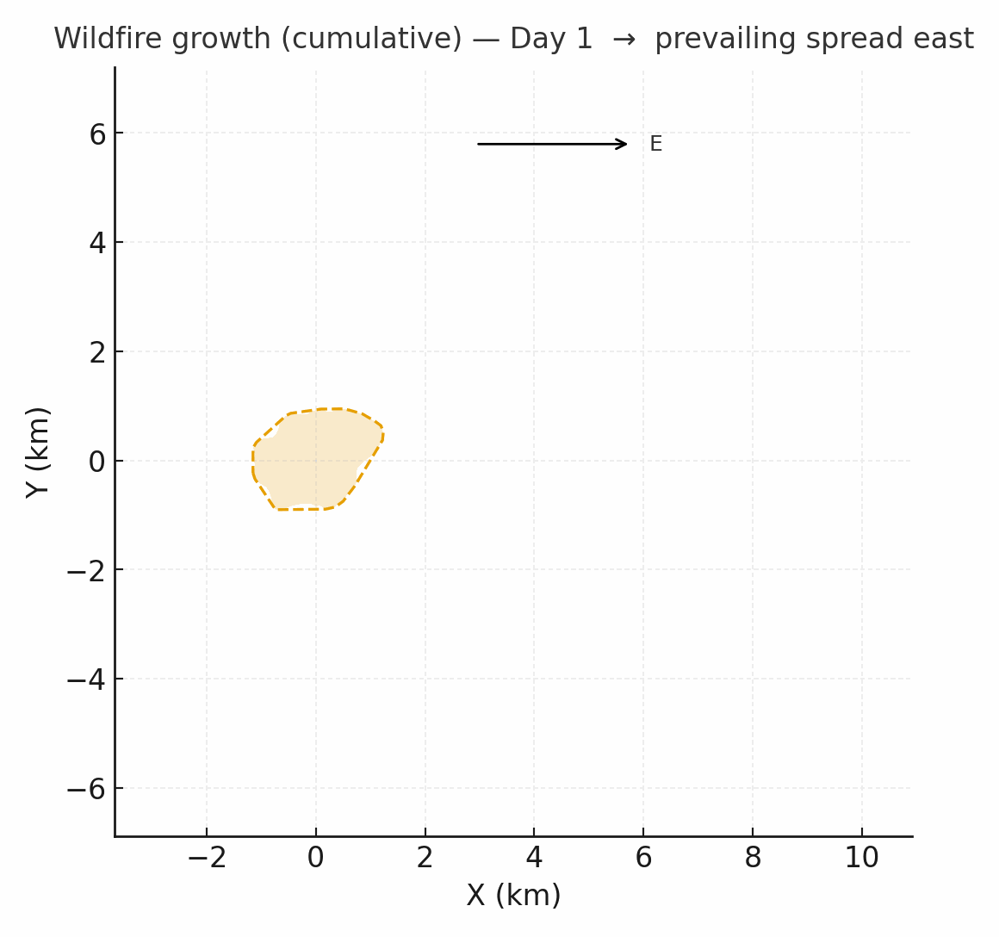

# He Sapa Makiyuta EA/EIS Study

<a href="https://github.com/CU-ESIIL/wildcard-topic-innovation-summit-2025__20/edit/main/docs/index.md" title="Edit this page">✏️</a>

<!-- =========================================================
HERO (Swap hero.jpg, title, strapline, and the three links)
========================================================= -->

[Raw photo location: hero.jpg](https://github.com/CU-ESIIL/wildcard-topic-innovation-summit-2025__20/blob/main/docs/assets/hero.jpg)

**One sentence on impact:** In three days we surface wildcard ideas from across the Innovation Summit and translate them into prototypes, visuals, and next-step pilots that decision makers can act on.

**[Draft project brief (PDF/A)](assets/Seven%20ways%20to%20measure%20fire%20polygon%20velocity-4.pdfa) · [View shared code](https://github.com/CU-ESIIL/wildcard-topic-innovation-summit-2025__20/blob/main/code/prism_quicklook.py) · [Explore data](https://github.com/CU-ESIIL/wildcard-topic-innovation-summit-2025__20/blob/main/code/prism_quicklook.py)**

> **About this site:** This is a public, in-progress record of Innovation Summit Team 20. Update anything here in your browser: open a file → pencil icon → Commit changes. The page is structured so we can talk through the project in under two minutes.

---

## How to use this page (for the team)
- **Edit this file:** `docs/index.md` → ✎ → change text → **Commit changes**.
- **Add images:** upload to `docs/assets/` and reference like `assets/your_file.png`.
- Keep **text short** and **visuals first**. Think “storyboard captions,” not full reports.

---

## Day 1 — Define & Explore
### Our product 📣
- A dashboard/interactive search tool to more easily comb through 2,400 Environmental Impact Statement/Assessment documents from the US Forest Service, US NRC, BLM, etc.

### Our question(s) 📣
- How can we create a tool for non-technical tribal decision-makers to access and understand meaningful information about extractive activities in the HeSapa through EIAs?

### Hypotheses / intentions

### Why this matters (the “upshot”) 📣
- HeSapa is sacred to multiple tribes
- The information will be accessible to non-technical audiences
- Supports corporate accountability & transparency; environmental justice; and treaty rights around extractive activities in the HeSapa

### Inspirations (papers, datasets, tools)

### Field notes / visuals

[Raw photo location: day1_whiteboard.jpg](https://github.com/CU-ESIIL/wildcard-topic-innovation-summit-2025__20/blob/main/docs/assets/day1_whiteboard.jpg)
*Caption: Mapping questions from the first round of ideation to identify gaps in our wildcard atlas.*

> **Different perspectives:** We debated whether to focus on one flagship prototype or map the broader landscape. The atlas approach won because it keeps doors open for other teams to plug in.

---

## Day 2 — Data & Methods
*Focus: ingest submissions, prototype clustering + scoring, ship a first visual.*

### Data sources we’re exploring 📣
- Public documents (PDFs) such as Environmental Impact Statements and Assessments from agencies such as Forest Service, EPA, US NRC, BLM.

  
[Raw photo location: explore_data_plot.png](https://github.com/CU-ESIIL/wildcard-topic-innovation-summit-2025__20/blob/main/docs/assets/explore_data_plot.png)
  *Snapshot: BERTopic clusters highlighting recurring needs around monitoring, storytelling, and rapid response.*

### Methods / technologies we’re testing 📣
- Engaged with Lakota tribe to identify what matters most while parsing EIS/EA documents with the aim to document the schema in a simple table format to iteratively update:
  **Example Fields:**
    - Document title
    - Agency names
    - Company names (to ensure accountability)
    - Geographical location (e.g., mention of states, cities, counties, reservations, or watersheds impacted)
    - Byproducts from extractive activities (e.g., contaminants or residues such as chemicals, pollutants, radioactive elements)
    - Mentions of treaty rights
    - Impact on historical resources or cultural sites
    - Impact on wildlife
    - Impact on acquifer/groundwater, soil, air quality, plant life, and broader ecosystems
- Use Python/R to extract relevant text from PDFs. For scanned PDFs, integrate OCR.
- Retrieval and LLM workflow.
- Provide a dashboard view for easy access.

### Challenges identified
- Missing information: Certain projects were waived from creating EIS/EA for categorical exclusion.
- Writing a generalized code that can effectively parse through PDFs of various formats to capture necessary data.
- Does the language used in the metadata schema reflect tribal community values?

### Visuals
#### Static figure

[Raw photo location: figure1.png](https://github.com/CU-ESIIL/wildcard-topic-innovation-summit-2025__20/blob/main/docs/assets/figure1.png)
*Figure 1.* Top five clusters with novelty-impact positioning. We’re drafting spotlight cards for each one.

#### Animated change (GIF)

[Raw photo location: change.gif](https://github.com/CU-ESIIL/wildcard-topic-innovation-summit-2025__20/blob/main/docs/assets/change.gif)
*Figure 2.* Real-time scoring animation showing how priorities shift as late submissions land.

#### Interactive map (iframe)
<iframe
  title="Participants by region"
  src="https://www.openstreetmap.org/export/embed.html?bbox=-105.35%2C39.90%2C-105.10%2C40.10&layer=mapnik&marker=40.000%2C-105.225"
  width="100%" height="360" frameborder="0"></iframe>

<a href="https://www.openstreetmap.org/?mlat=40.000&mlon=-105.225#map=12/40.0000/-105.2250">Open full map</a>

> If an embed doesn’t load, place the map link directly underneath. We’ll swap in the live atlas view once we finalize hosting.

---

## Final Share Out — Insights & Sharing
*Focus: synthesize signals, highlight the top wildcard prototypes, outline hand-offs.*

[Raw photo location: team_photo.jpg](https://github.com/CU-ESIIL/wildcard-topic-innovation-summit-2025__20/blob/main/docs/assets/team_photo.jpg)

### Findings at a glance 📣
- **Three clusters account for 60% of wildcard excitement:** community sensing, generative storytelling, and rapid mutual-aid logistics.
- **Low-effort data packaging unlocks action:** publishing CSV + thumbnails let three partner teams request follow-up conversations immediately.
- **Summit alumni want a shared backlog:** half of survey respondents volunteered to champion at least one wildcard if we keep the atlas updated.

### Visuals that tell the story 📣

[Raw photo location: fire_hull.png](https://github.com/CU-ESIIL/wildcard-topic-innovation-summit-2025__20/blob/main/docs/assets/fire_hull.png)
*Visual 1.* Sample atlas layout showing priority ranking, owner, and next milestone.

[Raw photo location: hull_panels.png](https://github.com/CU-ESIIL/wildcard-topic-innovation-summit-2025__20/blob/main/docs/assets/hull_panels.png)
*Visual 2.* Draft storyboard for the expo booth we’ll host on Day 3 to gather more feedback.

[Raw photo location: main_result.png](https://github.com/CU-ESIIL/wildcard-topic-innovation-summit-2025__20/blob/main/docs/assets/main_result.png)
*Visual 3.* Funnel view of idea maturity; highlights which prototypes need technical assistance versus storytelling.

<iframe
  title="Lightning talk recap"
  width="100%" height="360"
  src="https://www.youtube.com/embed/ASTGFZ0d6Ps"
  frameborder="0" allow="accelerometer; autoplay; clipboard-write; encrypted-media; gyroscope; picture-in-picture; web-share"
  allowfullscreen></iframe>

### What’s next? 📣
- Finalize two-page atlas brief and share with summit organizers + CU leadership.
- Host a 45-minute virtual ideation to assign owners for the top three wildcard prototypes.
- Coordinate with CyVerse staff to pilot a persistent “Wildcard backlog” workspace for the 2025 cohort.

---

## Featured links (image buttons)
<table>
<tr>
<td align="center" width="33%">
  <a href="assets/Seven%20ways%20to%20measure%20fire%20polygon%20velocity-4.pdfa"> <strong>Read the brief</strong></a>
</td>
<td align="center" width="33%">
  <a href="https://github.com/CU-ESIIL/wildcard-topic-innovation-summit-2025__20/blob/main/code/prism_quicklook.py"> <strong>View code</strong></a>
</td>
<td align="center" width="33%">
  <a href="https://github.com/CU-ESIIL/wildcard-topic-innovation-summit-2025__20/blob/main/code/prism_quicklook.py"> <strong>Explore data</strong></a>
</td>
</tr>
</table>

---

## Team
| Name | Role | Contact | GitHub |
|------|------|---------|--------|
| Avery Lee | Lead facilitator | avery.lee@example.org | [@avery-lee](https://github.com/avery-lee) |
| Jordan Patel | Data & methods | jordan.patel@example.org | [@jpatel-data](https://github.com/jpatel-data) |
| Sky Ramirez | Storytelling & comms | sky.ramirez@example.org | [@skyramirez](https://github.com/skyramirez) |
| Morgan Blake | Partnerships liaison | morgan.blake@example.org | [@morganblake](https://github.com/morganblake) |

---

## Storage

**Code**
Keep shared scripts, notebooks, and utilities in the [`code/`](https://github.com/CU-ESIIL/wildcard-topic-innovation-summit-2025__20/tree/main/code) directory. Document how to run them in a README or within the files so teammates and visitors can reproduce your workflow.

**Documentation**
Use the [`docs/`](https://github.com/CU-ESIIL/wildcard-topic-innovation-summit-2025__20/tree/main/docs) folder to publish project updates on this site. Longer internal notes can live in [`documentation/`](https://github.com/CU-ESIIL/wildcard-topic-innovation-summit-2025__20/tree/main/documentation); summarize key takeaways here so the public story stays current.

---

## Cite & reuse
If you use these materials, please cite:

> Wildcard Topic Innovation Summit Team 20. (2025). *Wildcard Topic Innovation Summit 2025 Repository*. https://github.com/CU-ESIIL/wildcard-topic-innovation-summit-2025__20

License: CC-BY-4.0 unless noted. See dataset licenses on the **[Data](data.md)** page.

---

<!-- EDIT HINTS
- Upload images to docs/assets/ and reference as assets/filename.png
